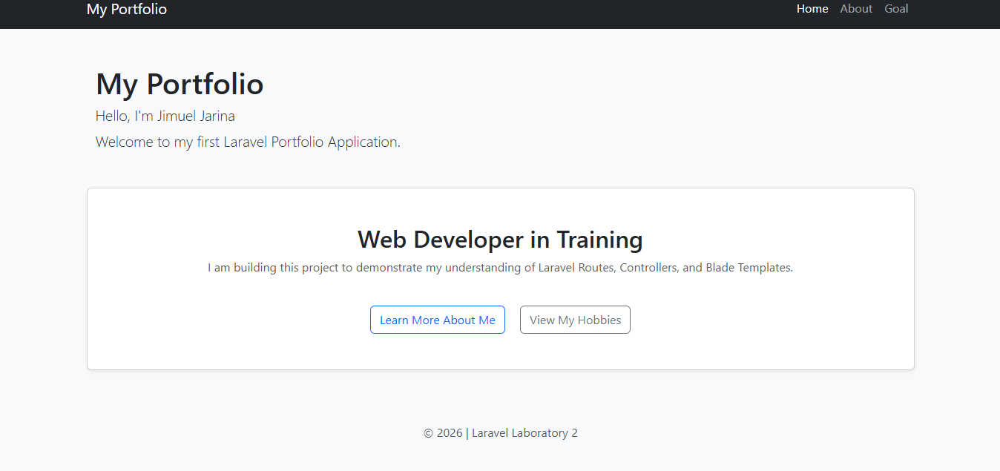
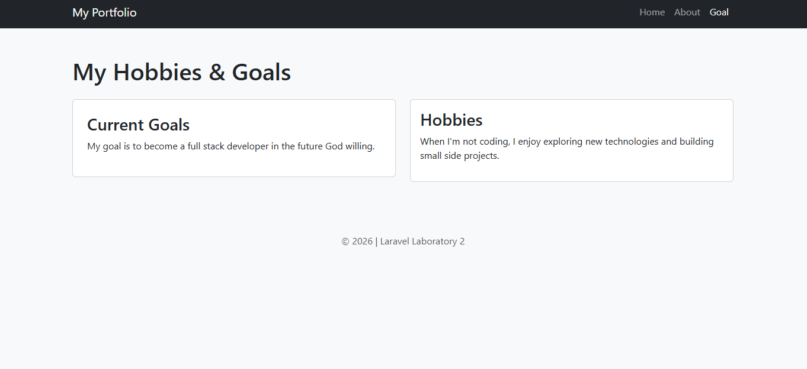

# Laboratory 2: Laravel Pages, Controllers, and Routes

### Student Information
Name: Jimuel Jarina
Date: February 11, 2026
Subject: WAD

### Project Overview
This is a Laravel-based portfolio application developed for Laboratory 3. It demonstrates how to use the MVC (Model-View-Controller) architecture by setting up custom routes, controllers, and styled Blade templates.

### Implemented Features
Routes: Configured in `routes/web.php` for Home, About, and Goal.
Controllers: Created `Home`, `About`, and `Goal`.
Views: Designed 3 responsive pages using Bootstrap CSS.

### Navigation Links
Once the server is running, you can access:
`http://127.0.0.1:8000/home` - Home
`http://127.0.0.1:8000/about` - About
`http://127.0.0.1:8000/goal` - Goal 

### How to Run Locally
1. Clone this repository.
2. Run `composer install`.
3. Create a `.env` file and run `php artisan key:generate`.
4. Run `php artisan serve`.

### Screenshots

#### Home Page

#### About Page

#### Goal Page
